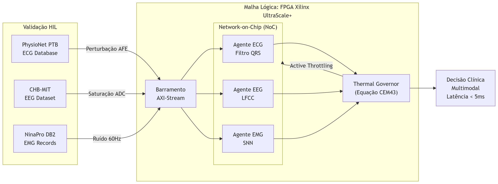

# 🛡️ Bio-NoC Guardian

**Arquitetura MAS em FPGA para Fusão Multimodal (ECG/EEG/EMG) com Controle Térmico Ativo e Emulação de Gêmeo Digital Imperfeito.**

[]()
[]()
[]()
[]()

> **Propósito:** Este repositório contém o código-fonte (RTL/HLS), os scripts de simulação e a infraestrutura de validação *Hardware-in-the-Loop* (HIL) para o projeto Bio-NoC Guardian, desenvolvido para submissão à conferência IEEE BioCAS.

---

## 📖 Sobre o Projeto

O **Bio-NoC Guardian** é um sistema de *Edge AI* focado na monitorização biomédica contínua para dispositivos vestíveis e implantáveis. A arquitetura afasta-se do paradigma sequencial tradicional (Von Neumann), utilizando o tecido lógico de um FPGA para implementar um **Sistema Multiagente (MAS)** distribuído. 

A principal inovação metodológica deste projeto é o **Controle Térmico Ativo**. Em vez de tratar o aquecimento do chip de forma passiva, a arquitetura calcula o dano térmico cumulativo em nível celular ($CEM43$) em tempo real e executa um *throttling* estruturado para evitar a necrose do tecido orgânico adjacente, sem interromper a inferência de sinais vitais críticos.

---
## Justificativa do Projeto e Relevância Clínica

A transição do monitoramento fisiológico contínuo para dispositivos vestíveis (*wearables*) e implantáveis exige o abandono de arquiteturas centralizadas baseadas em nuvem, devido à latência de transmissão e à vulnerabilidade dos dados. O processamento estrito na borda (Edge AI) em matrizes de portas programáveis (FPGAs) resolve o gargalo de von Neumann, garantindo paralelismo determinístico para a fusão simultânea de múltiplos biossinais (ECG, EEG e EMG).

Contudo, essa miniaturização impõe uma restrição termodinâmica severa. O chaveamento de transistores em malhas lógicas de alta densidade gera aquecimento por Efeito Joule. Em hardwares posicionados em contato direto com a pele ou tecido subcutâneo, a capacidade deficiente de dissipação térmica do encapsulamento pode induzir danos celulares irreversíveis (necrose), modelados quantitativamente pela métrica biomédica CEM43 (*Cumulative Equivalent Minutes at 43°C*).

Este projeto justifica-se pela proposição de uma arquitetura de Sistemas Multiagentes (MAS) que incorpora a governança térmica estrutural ativa diretamente no nível RTL. O sistema introduz um *Thermal Governor* que monitora e calcula o risco térmico em tempo real. Diante da iminência de dano tecidual, o governador atua sobre as regras de roteamento da *Network-on-Chip* (NoC) para executar o estrangulamento (*throttling*) seletivo de sinais não letais (atividade muscular - EMG). Essa intervenção reduz a dissipação de potência dinâmica e resfria o silício, garantindo que o monitoramento vital de suporte à vida (atividade cardíaca - ECG) opere de forma ininterrupta e clinicamente segura.

---

## ⚙️ Arquitetura e Inovações Técnicas

A arquitetura proposta abandona o processamento centralizado para implementar inteligência distribuída estrita na borda (Edge AI), garantindo paralelismo espacial massivo e determinismo temporal absoluto.

1. **Validação HIL e Imperfect Digital Twin:** Na ausência de um Analog Front-End (AFE), a verificação em silício utiliza simulação Hardware-in-the-Loop (HIL). O sistema processa fluxos contínuos de bancos de dados certificados (PhysioNet PTB/Apnea-ECG e NinaPro DB2). O diferencial reside na injeção parametrizada de falhas transientes e estocásticas (saturação de ADC, ruído 60Hz e deriva de impedância), estressando a imunidade assíncrona da malha de processamento sob condições reais de degradação.

2. **Network-on-Chip (NoC) via AXI-Stream:** A infraestrutura de comunicação dispensa arbitração centralizada. O uso de roteamento assíncrono via barramentos AXI-Stream previne bloqueios temporais (bus locking). Rajadas estocásticas geradas por espasmos neuromusculares (EMG) transitam como pacotes independentes (flits), impedindo a introdução de jitter no fluxo de extração de características do domínio cardiovascular (ECG).

3. **Sistemas Multiagentes (MAS) Heterogêneos:** O tecido lógico da Xilinx UltraScale+ é segmentado em Unidades de Processamento (PEs) encapsuladas e autônomas atuando em paralelo:
   * **Agente ECG:** Extração temporal em ponto fixo (Filtro QRS).
   * **Agente EEG:** Transposição espectral complexa (DSP / LFCC).
   * **Agente EMG:** Processamento de largo espectro baseado em eventos (SNN / Envelope).

4. **Thermal Governor (Governança Térmica Estrutural Ativa):** Módulo RTL dedicado à proteção orgânica contra necrose tecidual provocada pelo Efeito Joule em wearables. O agente monitora a temperatura do die e avalia a iminência de dano através de aproximação determinística da métrica termo-biológica CEM43 (via Lookup Table estrutural). Ao detectar inflexão térmica crítica (risco de aproximação aos 43°C), o governador atua nas regras da NoC forçando o descarte (throttling) de pacotes de biossinais periféricos não letais (EMG). Este estrangulamento ativo reduz instantaneamente o chaveamento lógico na malha, resfriando o silício e garantindo a manutenção ininterrupta da detecção de arritmias vitais do ECG.
---

---

## 📂 Estrutura do Repositório

O projeto segue uma hierarquia padronizada para design de *hardware*:

```text
Bio-NoC-Guardian/
│
├── hw/                   # Descrições de Hardware
│   ├── rtl/              # Códigos em Verilog/SystemVerilog (NoC, Agentes)
│   ├── hls/              # Códigos em C++ para Síntese de Alto Nível (Aceleradores IA)
│   └── ip/               # Módulos IP gerados ou de terceiros (Xilinx)
│
├── sim/                  # Ambiente de Simulação
│   ├── testbenches/      # Módulos de teste automatizado (Verilog)
│   └── scripts/          # Scripts Tcl para automação no ModelSim/Vivado
│
├── hil/                  # Infraestrutura Hardware-in-the-Loop
│   ├── datasets/         # Scripts de extração (PhysioNet PTB/CHB-MIT, NinaPro)
│   ├── injector/         # Código Python para injeção de dados via PCIe
│   └── fault_models/     # Modelos de ruído para o "Imperfect Digital Twin"
│
├── docs/                 # Documentação
│   ├── architecture/     # Diagramas de bloco e especificações técnicas
│   └── papers/           # Drafts do artigo e relatórios técnicos (LaTeX)
│
└── README.md


